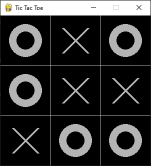
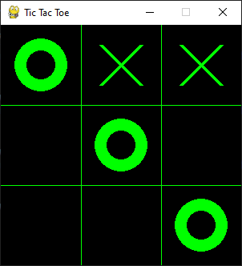
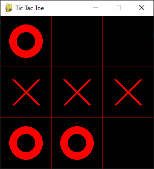
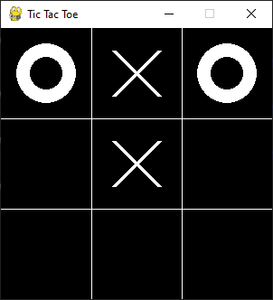

# Tic Tac Toe — AI Never Loses

This is a Tic Tac Toe game built in Python featuring a **clean GUI** and an **unbeatable AI opponent** powered by the Minimax algorithm. The game is simple, intuitive, and designed to challenge even the sharpest minds. Whether you're looking to test your logic skills or learn how Minimax works, this project has you covered :)

---

## Features

- **Unbeatable AI**: Uses the Minimax algorithm to make optimal moves.
- **Single Player Mode**: Play against the computer — it won’t let you win!
- **Clean Pygame GUI**: Modern, minimal board with colored highlights.
- **Main Menu**: Minimal main menu with level selection. 
- **Clean Codebase**: Modular design with separate files for game logic, AI logic, and utilities.

---

## Screenshots 

1. **Match Draw**



2. **Won Match**



3. **Lost Match**



4. **Match Continued**



---

## Tech Stack 

- **Python 3.12** — core language
- **Pygame** — 2D graphics and event handling
- **Minimax Algorithm** — core AI logic for unbeatable moves
- **OOP Design** — modular, scalable, and clean code structure

---

## How It Works

- The player chooses their symbol (X or O).
- Players take turns making moves on a 3x3 grid.
- The AI uses Minimax to evaluate all possible future moves and picks the one that maximizes its chance of winning (or forces a draw).
- The game ends when there's a winner or the board is full.

---

## Getting Started

1. **Clone the repo**
   ```bash
   git clone https://github.com/avik43218/TicTacToe.git
   cd TicTacToe
2. **Install requirements**
   ```bash
   pip install pygame
3. **Run the game**
   ```bash
   python start_game.py

---

## Controls & Gameplay 

1. **Place Mark**: Left click on the desired box
2. **Quit Game**: Close the window or hit Esc

The AI thinks instantly, so you may try to outsmart it, but- you can't! Good luck!

---

## Acknowledgements 

1. Pygame — for making 2D game development in Python delightful.

2. [NeuralNine](https://youtube.com/@neuralnine?si=dCjs2h2vIM9VsjUM) — For their excellent Python tutorials. 

3. Classic Minimax implementations & game-theory tutorials that inspired the AI logic.

4. The Python community and countless Stack Overflow threads for continuous learning.

---

## License

This project is licensed under the [MIT License](./LICENSE).

Good luck trying to beat the AI! You'll need it!
